# Bike Sharing Company Analysis for Market Strategy

## Background and overview

In 2016, Cyclistic launched a successful bike sharing offer. Since then, the program has grown to a fleet of 5,824 bikes that are geolocated and locked at a network of 692 stations in Chicago. 
Bikes can be unlocked at one station and returned to any other station in the system at any time.

Until now, Cyclistic's marketing strategy has been based on generating general awareness and appealing to broad consumer segments. One approach that helped make these things possible was the flexibility of its pricing plans: single-ride passes, day passes and single-ride passes, full-day passes, and annual memberships. Customers who purchase single-ride or all-day passes are referred to as **casuals**. Customers who purchase annual memberships are referred to as **members**.

Cyclistic's financial analysts have concluded that annual members are much more profitable than casual riders. While flexible pricing helps Cyclistic attract more customers, the marketing director believes that maximizing annual memberships will be key to future growth. Rather than creating a marketing campaign that targets new customers, she believes there is a very good opportunity to convert casual users into members. She points out that casual users are already aware of the Cyclistic program and have chosen Cyclistic for their mobility needs.

This project analyzes Cyclistic's historical cycling trip data to design marketing strategies aimed at converting casual cyclists into annual members.

The data set being used comes from a company called [Divvy](https://divvybikes.com/). Here is the [data](https://divvybikes.com/system-data).

Findings and recommendations are provided in the following key areas:

- Temporal comparative analysis: analyzes and discovers patterns at different temporal granularities.

- Behavioral analysis: Analyze the usage patterns of Cyclistic users.

## Data Structure and Initial Checks

Cyclistic has data for the second quarter of 2024, containing 1,735,239 observations, each one representing one represents one trip. Since the data is anonymized, it is impossible to determine how many users made that number of trips in the period used. In the dataset, there are 13 columns dedicated to collecting information about each trip. Here, I show the purpose of each column:

| Column             | Purpose                                                                  |
|--------------------|-------------------------------------------------------------------------|
| ride_id            | A number that uniquely identifies a ride                                 |
| rideable_type      | Type of bicycle used. It can be classic, electric, or docked            |
| started_at         | Start date of a ride                                                    |
| ended_at           | End date of a ride                                                      |
| start_station_name | Name of the starting station of a ride                                   |
| start_station_id   | A number that uniquely identifies a station                              |
| end_station_name   | Name of the ending station of a ride                                     |
| end_station_id     | A number that uniquely identifies a station                              |
| start_lat          | Latitude recorded at the start of a ride                                |
| start_lng          | Longitude recorded at the start of a ride                               |
| end_lat            | Latitude recorded at the end of a ride                                  |
| end_lng            | Longitude recorded at the end of a ride                                 |
| member_casual      | Type of membership of the user who took the ride                        |

The detailed report can be found in [Kaggle](https://www.kaggle.com/code/christianmontenegro/case-study-cyclistic). The open standard process model used is [CRISP-DM](https://www.datascience-pm.com/crisp-dm-2/).

## Executive summary

### Overview of Findings

Users show distinct patterns when using Cyclistic. Casual users took a smaller number of trips, of longer duration and distance when inspecting it at different granularities. Users take these trips on routes near Lake Michigan that include natural parks and other entertainment venues. Annual users do the opposite. They take trips on routes encompassing multiple types of businesses, residential properties, condominiums, or residential complexes. Peak usage of the service is between 8:00 a.m. and 5:00 p.m. (annual users) and between 1:00 p.m. and 4:00 p.m. (casual users). Both prefer the use of classic bicycles over electric bicycles. The following sections will sections will detail this.

### Temporal comparative analysis

### Comparative time analysis

#### Trip duration

Trips by casual users have a median trip length of 13.96 minutes or 59.33% longer when compared to annual users (8.76 minutes). Different granularities maintain this. At the monthly level, they have a median duration of 14.5 minutes, or 63.83% more compared to annual users (8.85 minutes).

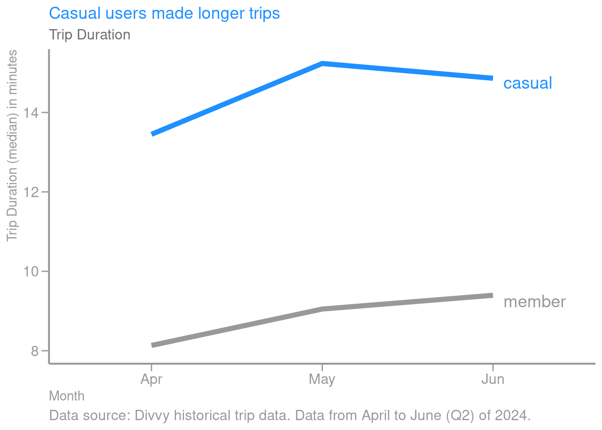

 At the weekly level, casual users have a median duration of 14.3 minutes or 58.63% more when compared to annual users (9 minutes). Annual users (9 minutes). Both types of users made longer trip durations on weekends. 

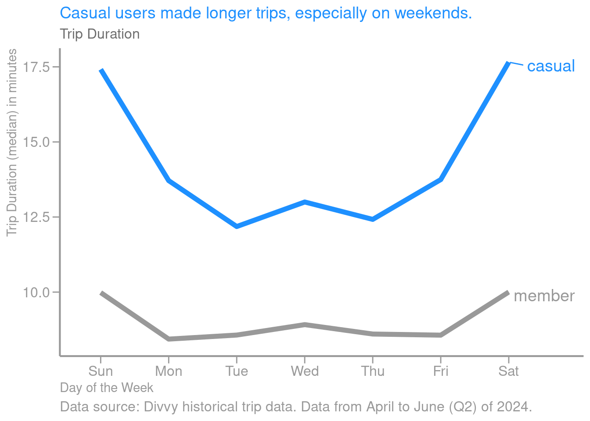

At the daily level, casual users have a median trip duration of 13.09 minutes or 55.35% longer compared to annual users (8.44 minutes). 

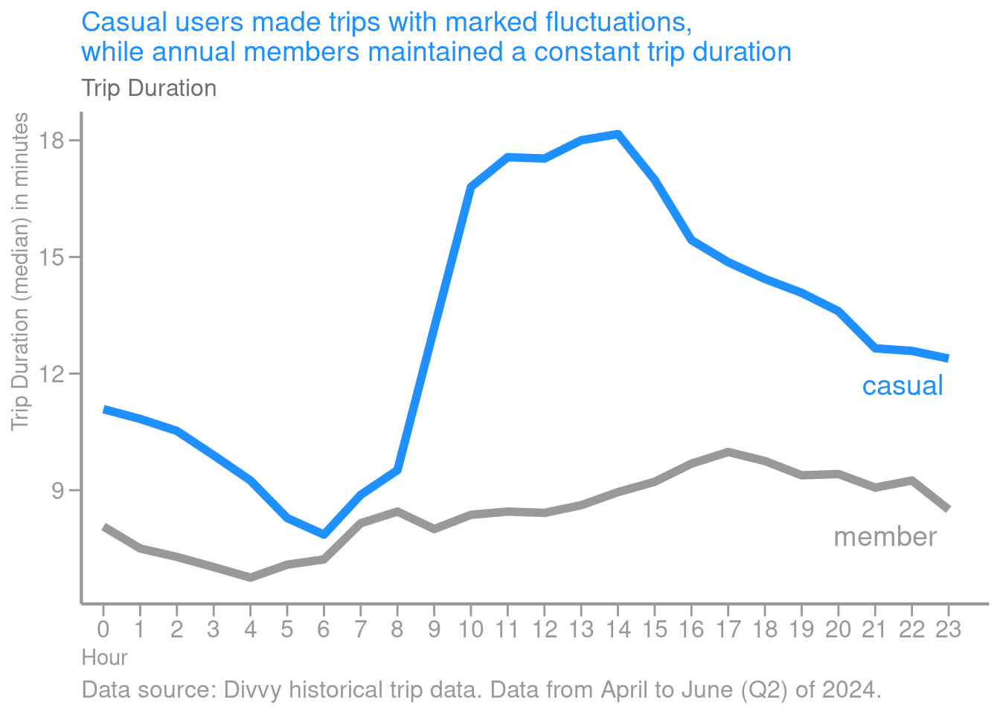

This also reveals that casual users took trips with fluctuating trip durations, while annual users remained constant.

#### Trip distance

Casual user trips have a median distance of 1.71 km or 13.2% more when compared to annual users (1.51 km). This holds at different granularities. At the monthly level, casual users made trips with a median distance of 1.74 km or 14.15% more when compared to annual users (1.52 km).

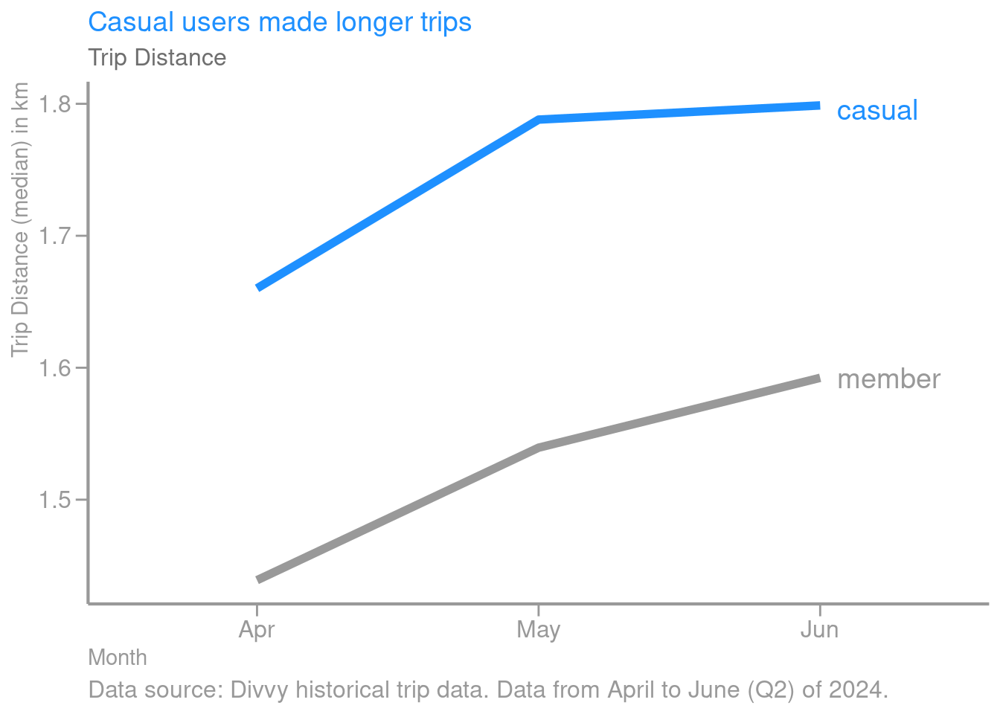

At the weekly level, casual users made trips with a median distance of 1.74 km or 13.4% more when compared to annual users (1.53 km). Both types of users made longer trips on weekends. 

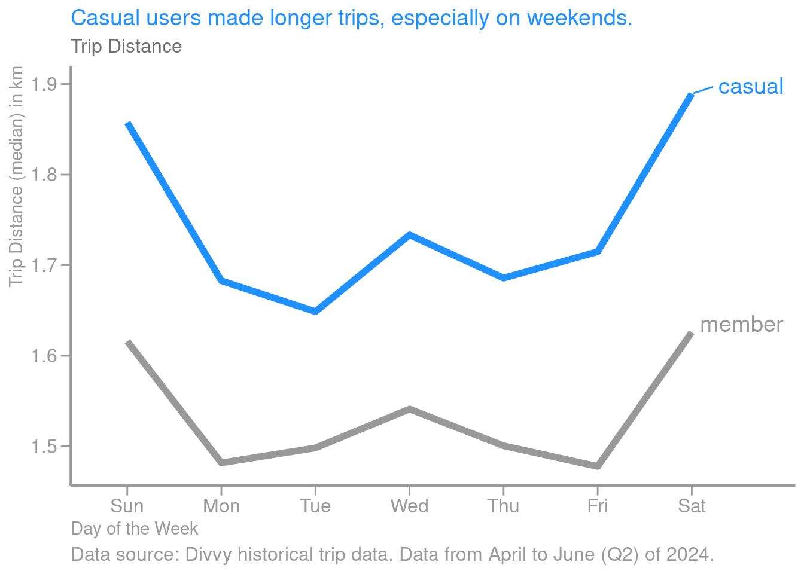

On a daily level, casual users made trips with a median distance of 1.67 km or 12.3% more when compared to annual users (1.49 km).

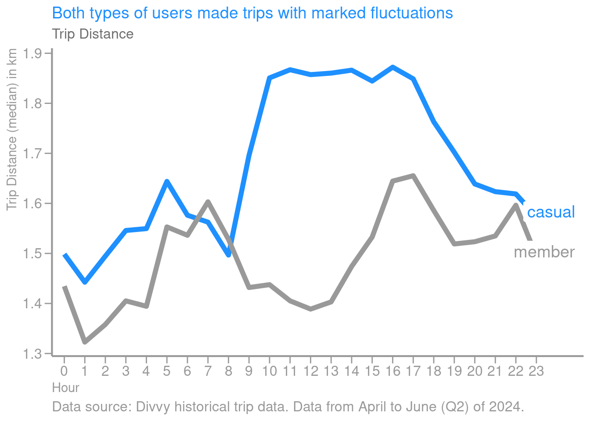

This also reveals that both types of users made trips with fluctuating distances.

#### Frequency of trips

Annual users made more trips (73.44%) than casual users when inspected at different granularities. They made 617,510 trips in the last quarter, while casual users made 354,863.

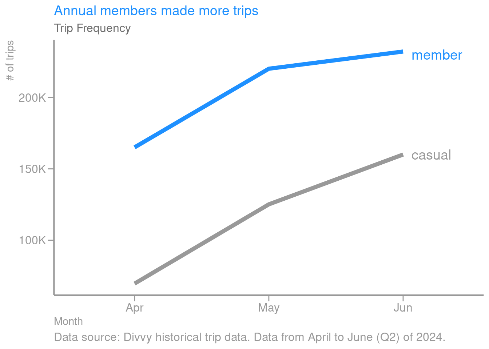

At the weekly level, annual users made an average of 88,216 trips, while casual users made 50,694 trips. 50,694 trips, a 74.25% increase. Annual users traveled more frequently on weekdays, while casual users did the opposite, casual users did the opposite. 

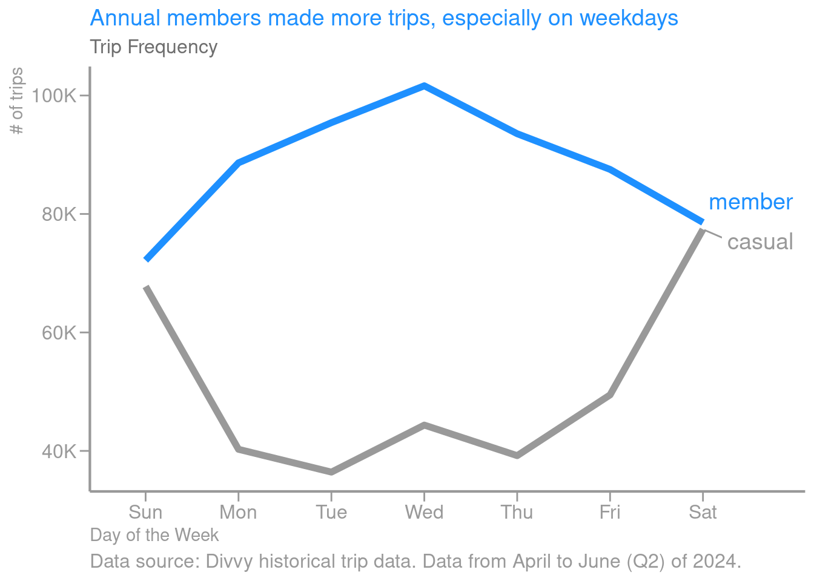

At the daily level, annual users made an average of 25,730 trips, while casual users made 14,786 trips, representing an average of 14,786 trips. 14,786 trips, representing 74.01% more. This reveals that both types of users made trips with fluctuating frequency at different times of the day. 

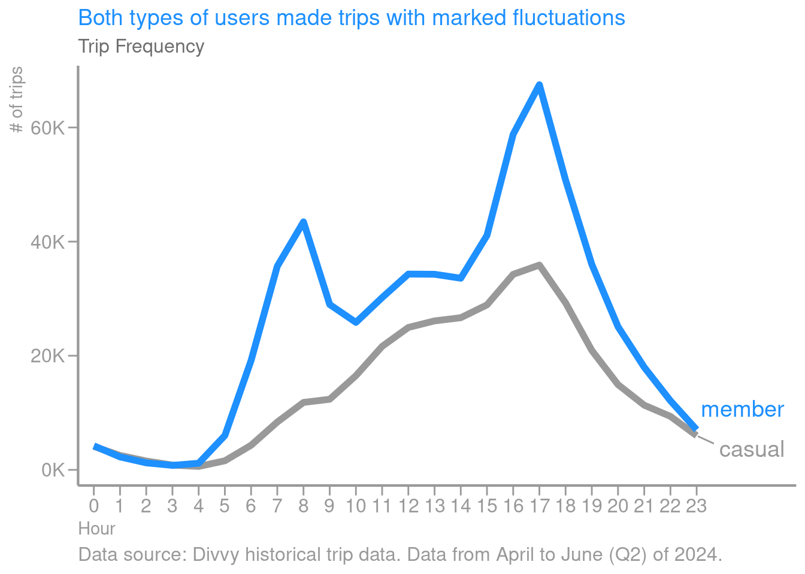

#### Bicycle type preference

Both types of users prefer classic bicycles (62%) for their trips. This pattern remains consistent at different granularities.

### Behavioral analysis

Annual users made more trips at 8 am and 5 pm. This could be because this type of user uses bicycles to commute to and from work.

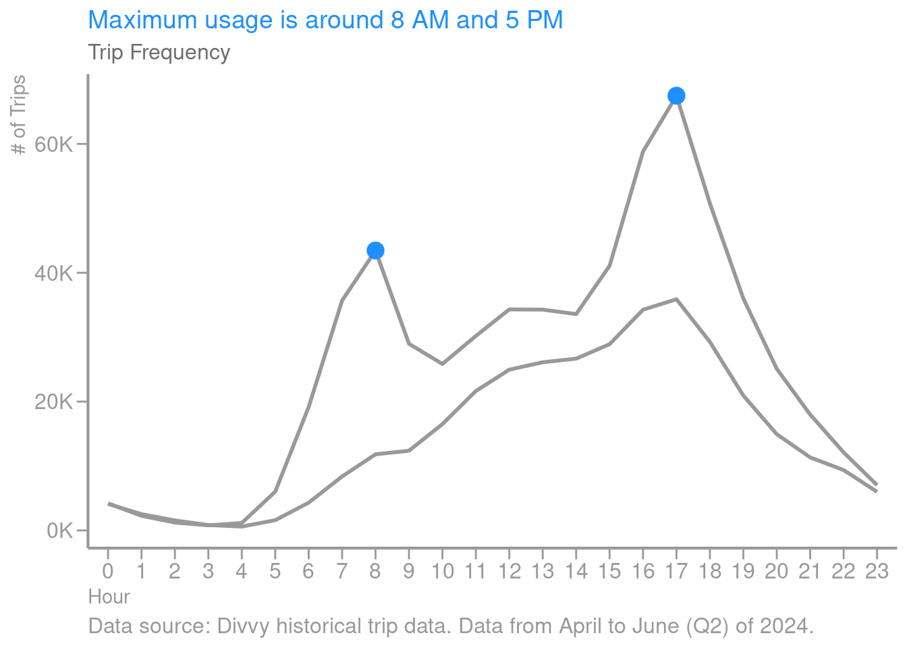

Meanwhile, casual users used them in the period from 1 to 4 pm. The reason for this could be that they use the bicycles for sightseeing or other non-work-related activities.

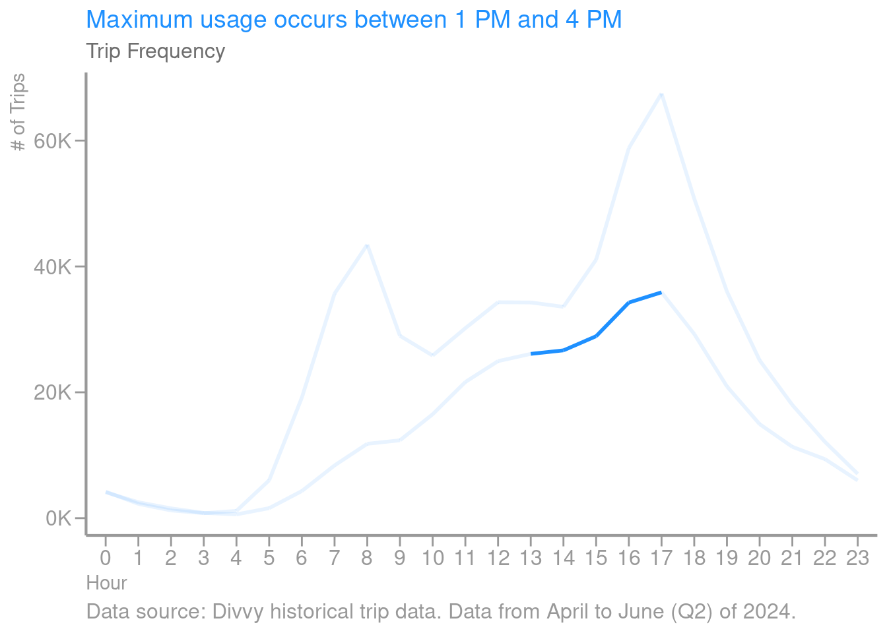

In analyzing the routes of both types of users, annual users mostly used routes encompassing multiple types of businesses, residential properties, condominiums, or residential complexes. While casual users mostly traveled routes near Lake Michigan that included natural parks and other entertainment venues. The following figure provides insight into the above by visualizing the top 10 most used routes by user type. The following figure illustrates the 10 most popular routes.

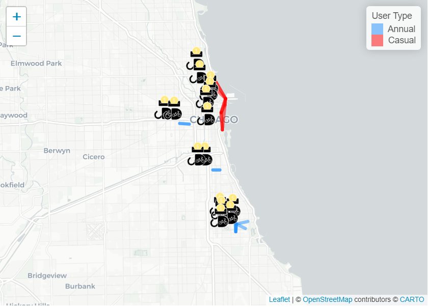

Stations also repeat the same pattern. Annual users used more stations located in residential locations, or near businesses, with a few exceptions. While casual users used more stations that are close to tourist, leisure, or rental locations. The following figure allows us to understand the above by visualizing the 10 most used stations by type of user.

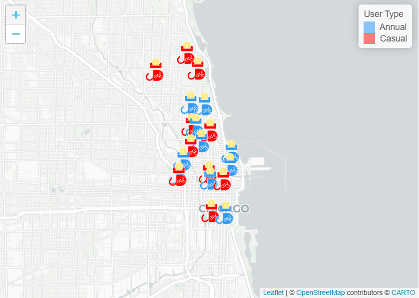

## Recommendations

Based on the insights gained about the usage patterns of annual and casual users, here are some practical recommendations:

- Create promotions based on seasonal usage patterns: Offer special discounts or limited-time promotions on annual memberships targeted at casual users on the weekend. These promotions could emphasize how an annual membership would reduce the cost of frequent weekend usage and allow them to take advantage of weekdays for free or at a discounted price. Run midday promotions (e.g., 1-4 p.m.) with pop-up ads, email notifications, or in-app notifications that highlight the benefits of annual memberships, such as unlimited travel or discounts for longer trips.

- Leverage geographic preferences for targeted advertising: Create targeted ads near tourist attractions (both physical ads and digital ads and geo-targeted mobile ads) that emphasize the convenience and cost-effectiveness of an annual membership for those who frequently visit these areas. This could especially appeal to local tourists or residents who frequently visit these locations, but have not committed to an annual membership.

- Promote the convenience of commuting using annual memberships. Target casual users who use the system during peak commute times (or near residential stations) by promoting the benefits of an annual membership for commuting. Highlight the cost savings for those who would otherwise pay for individual trips during peak commute times. Also, Cyclistic could partner with local businesses to offer corporate memberships where employers can subsidize annual memberships for their employees. This would be especially appealing to casual riders who use the service occasionally to commute but have not yet committed to an annual membership.

- Encourage casual users to become frequent users: Offer trip-based incentives (e.g., after a certain number of casual rides, they get a discount on an annual membership) to encourage casual users to consider upgrading. We can structure it as a loyalty program that rewards frequent usage with membership discounts. Additionally, we can create membership packages specifically for casual users who mostly use Cyclistic on weekends or for leisure. These packages could include additional benefits such as discounts on bike rentals for friends or free ride credits for weekend trips, making annual membership more attractive to regular cyclists.

- Highlight the benefits of classic bikes in membership plans: Since both types of users prefer classic bikes, emphasize unlimited use of classic bikes in annual membership promotions. For casual users, emphasize how membership allows unlimited leisure rides on their preferred type of bike.

- Optimize station locations for casual users: Cyclistic could consider increasing the number of stations near tourist and leisure locations, as these are most used by casual users. This would make the service more attractive and accessible to casual users, increasing the likelihood of conversion.

- Promote exclusive member benefits at high-traffic stations: Offer exclusive benefits to annual members at stations close to high-traffic tourist or leisure locations (priority bike access, discounts). This would encourage casual users to consider upgrading to access these benefits.